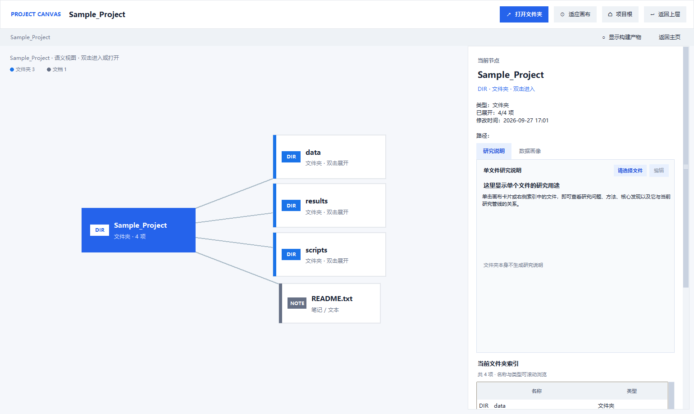
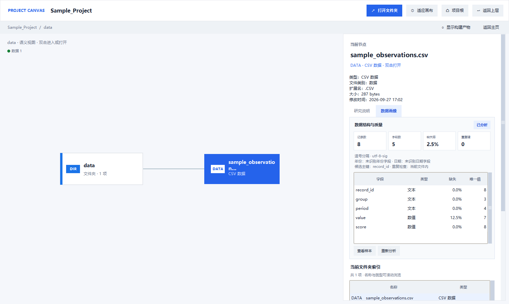

# Research Pipeline Console / 研究流程控制台

**English:** A Windows desktop tool for browsing local project folders, tracking folder-level research work, and reviewing selected data files. Built with Python and Tkinter.

**中文：** 一款 Windows 桌面工具，用于浏览本地研究项目目录、管理文件夹级研究工作并查看所选数据文件。基于 Python 和 Tkinter 构建。

## Screenshots / 软件截图

The screenshots use a fictional project and synthetic observations. / 以下截图使用虚构项目和合成示例数据。

### Project file canvas / 项目文件画布

Browse a project's folder structure and review file details and local notes. / 浏览项目文件夹结构，查看文件信息和本地说明。



### Data profile / 数据画像

Inspect a selected supported data file, including field types, missing values, and basic quality summaries. / 对所选支持格式的数据文件查看字段类型、缺失值和基础质量摘要。



## Overview / 软件定位

**English:** Research Pipeline Console is a local Windows desktop workspace for researchers who organize work in folders. It provides a portfolio-style index across selected roots, a visual browser for each project's files, local project and file notes, checks for broken absolute-path references, and a read-only profile for selected data files. It is intended to make an existing folder-based workflow easier to navigate; it does not replace a reference manager, database, cloud drive, or team task tracker.

**中文：** Research Pipeline Console 是一款面向文件夹式研究工作的 Windows 本地桌面工具。它把多个选定目录下的项目集中到总览中，提供项目文件画布、本地项目与文件说明、绝对路径引用检查，以及对所选数据文件的只读画像。它用于更方便地浏览和整理已有文件结构，不是文献管理器、数据库、云盘或团队任务系统。

## Typical workflow / 常见使用流程

1. **Choose roots / 选择根目录：** Add one or more local folders and save the list. The application discovers immediate child folders as projects; it does not recursively treat every nested folder as a separate project.
2. **Scan / 执行扫描：** Run a read-only scan to update folder and file counts and check supported text/code files for absolute Windows paths. Each reference is marked as found or missing and linked to its source file and line when available.
3. **Browse / 浏览项目：** Open a project in the zoomable canvas, expand folders as needed, inspect file types and details, and open a selected item with its Windows default application.
4. **Review data / 查看数据：** Select a supported data file to calculate a local profile. The profile is a quick screening aid, not a substitute for validating a dataset's definitions or research design.
5. **Keep context / 记录说明：** Add or edit project and file notes in the application. These notes are stored as application state and do not modify the source files.

**中文流程：**

1. **选择根目录：** 添加一个或多个本地目录并保存。程序将根目录的直接子文件夹登记为项目，不会把所有更深层的目录都自动当成独立项目。
2. **执行扫描：** 运行只读扫描，更新目录和文件数量，并检查受支持的文本/代码文件中是否引用了绝对 Windows 路径。程序会标记路径当前是否存在，并尽可能给出来源文件和行号。
3. **浏览项目：** 在可缩放的画布中打开项目，按需展开子文件夹，查看文件类型和信息，并用 Windows 默认应用打开所选文件或目录。
4. **查看数据：** 选择受支持的数据文件生成本机数据画像。画像适合快速检查，不替代对变量定义或研究设计的正式核验。
5. **记录说明：** 在程序中添加或编辑项目说明和文件说明。这些说明保存在应用状态目录，不会改写原始文件。

## Feature guide / 功能详解

### Project portfolio / 研究项目总览

The overview discovers immediate project folders below the configured roots and shows their names, root group, current discovery status, and whether the path exists. Search and filters help narrow the list. The summary cards show discovered project, scanned file, and path-reference counts from the latest scan.

总览会发现已配置根目录下的直接子项目文件夹，并显示项目名称、所属根目录、发现状态和路径是否存在。可以搜索和筛选项目；概览卡片展示项目数、最近扫描的文件数和路径引用数。

### Visual folder canvas / 项目文件画布

The canvas lays out the selected folder's immediate children as cards connected to their parent. Double-click a folder to enter it; use the side index to browse names and file types. The canvas supports zooming, panning, lazy loading of large folders, and an option to reveal common build artifacts. Selecting a file shows its metadata and available local notes; opening it uses the operating system's default application.

画布会把当前目录的直接子项显示为与父目录相连的卡片。双击文件夹可进入下一层，也可通过侧边索引浏览名称和文件类型。画布支持缩放、拖动、按需加载大型目录，以及显示常见构建产物。选中文件后可以查看文件信息和已有说明；打开文件时调用操作系统默认应用。

### Project and file notes / 项目与文件说明

Project-level notes and file-level notes can be edited inside the app. Notes, folder choices, and scan snapshots are kept in local JSON files under `state/`; back up or protect this folder if those notes matter to you. The app does not write the notes into the research documents themselves.

可以在软件中编辑项目级和文件级说明。说明、目录配置和扫描快照以本地 JSON 文件保存在 `state/`；如需保留这些说明，请自行备份或保护该目录。程序不会把说明写入论文、数据或其他研究源文件。

### Path-reference health / 路径引用检查

The scanner checks supported text and code files for absolute Windows path references and reports the source file, line, referenced path, and whether the target currently exists. A missing path is only a prompt to review an old or machine-specific reference: the app never rewrites scripts or repairs paths automatically.

扫描器会检查受支持的文本和代码文件中的绝对 Windows 路径引用，并报告来源文件、行号、引用路径及其当前是否存在。缺失提示只用于帮助人工核对旧路径或机器专属路径；软件不会自动改写脚本或修复路径。

### Local data profile / 本地数据画像

For selected CSV/TSV, Excel, Stata, SPSS, Parquet, and Feather files, the app can show field names and types, row/column counts when available, per-field missing and unique-value counts, an overall missing rate, a heuristic candidate key and duplicate check, and detectable year/date coverage. A small sample can be opened separately. Deep profiling depends on pandas/openpyxl and, for some formats, additional reader packages. Large files may be sampled (up to 50,000 rows); results identify when checks use a sample. Pickle files are deliberately not deserialized automatically.

对选中的 CSV/TSV、Excel、Stata、SPSS、Parquet 和 Feather 文件，程序可展示字段名称与类型、可获得的行列数、字段缺失率与唯一值数量、总体缺失率、启发式候选主键与重复检查，以及可识别的年份/日期范围；还可单独打开少量样本。深度画像依赖 pandas/openpyxl，部分格式还需要额外读取器。大型文件可能按最多 50,000 行抽样，界面会标明抽样结果。为避免执行不可信的序列化对象，PKL 文件不会被自动反序列化。

### Scan history and project map / 扫描记录与项目结构图

The scan log records the latest scan time, root-level directory/file counts, and path-reference totals. The project map is generated from the local roots and their immediate project folders at runtime. Double-click a card to open the corresponding directory.

扫描记录会显示最近扫描时间、各根目录的目录/文件数量和路径引用总数。项目结构图会在运行时根据本机已配置的根目录及其直接子项目动态生成；双击卡片可打开对应目录。

## Data handling and limits / 数据处理与适用边界

- The initial scan reads directory names, file metadata, and supported text files to locate path references. It does not upload watched-folder contents or include them in the source repository or portable ZIP.
- When you request a profile, the selected data file is read locally to calculate the displayed summary and sample. Review the sample before sharing a screenshot.
- App configuration, scan snapshots, and notes may reveal local paths or research context. They live under `state/` and should be treated as private local data.
- The app is a local, single-user Windows utility. It has no cloud synchronization or multi-user collaboration service, and it does not edit, move, or delete monitored files.

- 首次扫描会读取目录名、文件信息，并读取受支持的文本文件以查找路径引用；它不会上传受监控目录的内容，也不会把这些内容打包进源码仓库或便携 ZIP。
- 只有在你请求生成画像时，程序才会在本机读取所选数据文件并计算界面显示的摘要和样本。分享截图前请先检查样本内容。
- 应用配置、扫描快照和说明可能包含本地路径或研究背景，应视为私人本地数据，保存在 `state/` 目录。
- 本软件是本地单用户 Windows 工具，不提供云同步或多人协作服务，也不会编辑、移动或删除受监控文件。

## Requirements

- Windows 10 or later
- Python 3.10 or later with Tk/Tkinter installed
- Optional profiling packages listed in `requirements.txt`

The GUI and directory scan use only the Python standard library. Install the optional profiling packages in a virtual environment:

```powershell
python -m venv .venv
.\.venv\Scripts\Activate.ps1
python -m pip install --upgrade pip
python -m pip install -r requirements.txt
```

## Run

From the project directory:

```powershell
python research_pipeline_console.py
```

You can also double-click `start_console.cmd`. On first launch, the fallback root is `~/Documents/Research`; add the folders you want to monitor in the sidebar. Root choices are saved locally in `state/console_config.json` and are not part of the source distribution.

## Self-test

```powershell
python research_pipeline_console.py --self-test
```

The self-test creates a synthetic fixture in a temporary directory. It does not read saved settings, scan watched folders, or write into the project's `state/` directory.

## Optional Windows executable build

```powershell
python -m pip install -r requirements-build.txt
pyinstaller ResearchPipelineConsole.spec
```

Build output is written to `build/` and `dist/`. The bundled application uses the data-profile helper script; enhanced profiling also needs an available Python environment with the optional profiling packages installed.

## Portable Windows release

Download the Windows x64 ZIP from the GitHub Releases page, extract it to a writable folder, and run `ResearchPipelineConsole.exe`. The ZIP contains the application, this README, the GPL license, and third-party notices; it does not include research data or local application state. Enhanced data profiling requires an available Python environment with the optional packages in `requirements.txt`.

## Data and repository hygiene

This repository contains software only. Do not commit papers, research notes, database copies, downloaded caches, generated presentations, licensed data, or data exports. Third-party datasets remain subject to their own agreements; access through this software does not grant permission to redistribute them. The `.gitignore` excludes common local state, build output, research documents, and data-export formats. Review the staged file list before any commit.

## License

Copyright (C) 2026 Qi Wang. This project is licensed under the GNU General Public License v3.0 only (`GPL-3.0-only`). See `LICENSE` for the complete license text. Third-party dependency notices are listed separately in `THIRD_PARTY_NOTICES.md`.
